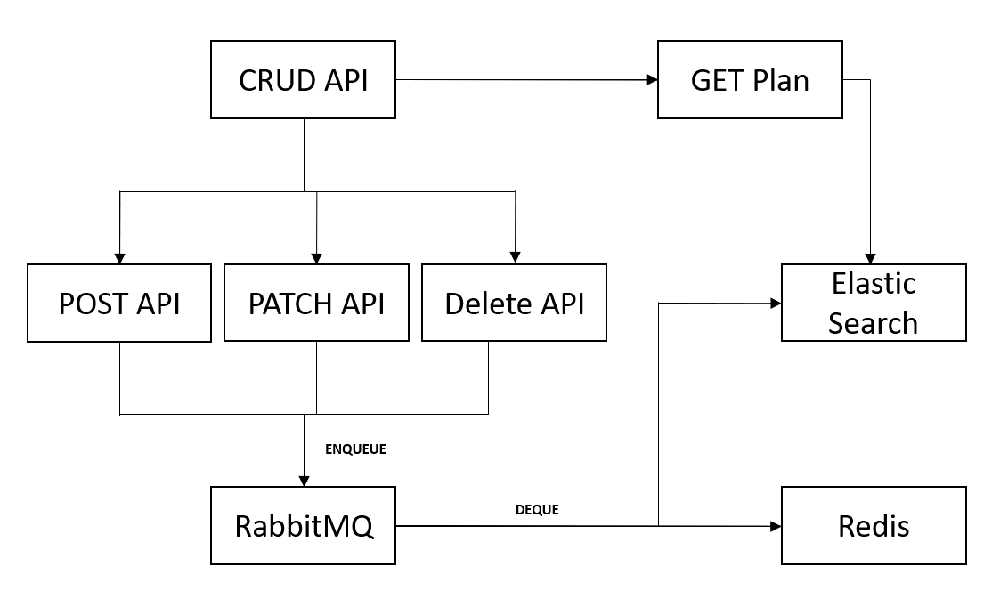

# Healthcare Plan Management API
This repository provides a robust system for managing healthcare plans with efficient data storage, retrieval, and search capabilities. The API supports creating, updating, deleting, and fetching healthcare plans, leveraging both Redis for key-value storage and Elasticsearch for indexing and search functionality. It is designed to scale and perform efficiently, making it ideal for systems that require both quick data access and powerful search functionalities.

### Key Features

- **CRUD Operations:** 
  - Easily create, update, delete, and fetch healthcare plans via RESTful APIs.

- **Asynchronous Processing:** 
  - Requests for create, update, and delete operations are queued in RabbitMQ, ensuring non-blocking, high-performance processing.

- **Data Storage:** 
  - **Redis:** Quick access to healthcare plan data using a key-value store.
  - **Elasticsearch:** Advanced search and indexing capabilities for complex queries and full-text search.

- **Queue Management:** 
  - RabbitMQ handles the queuing of requests, ensuring efficient processing and reliable execution of operations.



## Oauth Postman setup
https://blog.postman.com/how-to-access-google-apis-using-oauth-in-postman/

## Docker command to create redis container
```
$ docker run -d --name my-redis-stack -p 6379:6379 redis
```

## Docker command to create RabbitMQ image
```
$ docker run -d -p 5672:5672 -p 15672:15672 rabbitmq:3-management
```

## Start Elastic Search and Kibana cluster
```
To start the cluster
$ docker-compose up

To stop the cluster
$ docker-compose down
```

## Contents of .env file
```
# .env
PYTHON_ENV = "development"

DEV_PORT = "5000"
DEV_HOST = "localhost"
REDIS_DEV_HOST = "localhost"
REDIS_DEV_PORT = "6379"
RABBITMQ_DEV_HOST = "localhost"
RABBITMQ_DEV_PORT = "15672"
DEV_VERSION = "v1"
DEV_OAUTH_CLIENT_ID = "<OAUTH_CLIENT_ID>"
DEV_ELASTIC_HOST = "http://localhost:9200/"

PROD_PORT = "5000"
PROD_HOST = "localhost"
REDIS_PROD_HOST = "localhost"
REDIS_PROD_PORT = "6379"
RABBITMQ_PROD_HOST = "localhost"
RABBITMQ_PROD_PORT = "15672"
PROD_VERSION = "v1"
PROD_OAUTH_CLIENT_ID = "<OAUTH_CLIENT_ID>"
PROD_ELASTIC_HOST = "http://localhost:9200/"
```

## API Definitions
### POST /v1/plan
This API creates the plan and stores every nested object in the body data into multiple different key-values
<br />Body:
```
{
    "planCostShares": {
        "deductible": 2000,
        "_org": "example.com",
        "copay": 23,
        "objectId": "1234vxc2324sdf-501",
        "objectType": "membercostshare"
    },
    "linkedPlanServices": [
        {
            "linkedService": {
                "_org": "example.com",
                "objectId": "1234520xvc30asdf-502",
                "objectType": "service",
                "name": "Yearly physical"
            },
            "planserviceCostShares": {
                "deductible": 10,
                "_org": "example.com",
                "copay": 0,
                "objectId": "1234512xvc1314asdfs-503",
                "objectType": "membercostshare"
            },
            "_org": "example.com",
            "objectId": "27283xvx9asdff-504",
            "objectType": "planservice"
        },
        {
            "linkedService": {
                "_org": "example.com",
                "objectId": "1234520xvc30sfs-505",
                "objectType": "service",
                "name": "well baby"
            },
            "planserviceCostShares": {
                "deductible": 10,
                "_org": "example.com",
                "copay": 175,
                "objectId": "1234512xvc1314sdfsd-506",
                "objectType": "membercostshare"
            },
            "_org": "example.com",
            "objectId": "27283xvx9sdf-507",
            "objectType": "planservice"
        }
    ],
    "_org": "example.com",
    "objectId": "12xvxc345ssdsds-508",
    "objectType": "plan",
    "planType": "inNetwork",
    "creationDate": "12-12-2017"
}
```

### PATCH /v1/plan/<plan_id>
This API updates plan data of the plan_id provided in the Redis and Elastic Search
<br />Body:
<br />`Note: In this body, the planCostShare values are updated, and a new linkedPlanServices object is added.`
```
{
    "planCostShares": {
        "deductible": 2056300,
        "_org": "example.com",
        "copay": 2235533,
        "objectId": "1234vxc2324sdf-501",
        "objectType": "membercostshare"
    },
    "linkedPlanServices": [
        {
            "linkedService": {
                "_org": "example.com",
                "objectId": "1234520xvc30asdf-502-abc",
                "objectType": "service",
                "name": "Yearly physical"
            },
            "planserviceCostShares": {
                "deductible": 3000,
                "_org": "example.com",
                "copay": 24210,
                "objectId": "1234512xvc1314asdfs-503-abcd",
                "objectType": "membercostshare"
            },
            "_org": "example.com",
            "objectId": "27283xvx9asdff-504-abc",
            "objectType": "planservice"
        }
    ]
}
```

### GET /v1/plan/<plan_id>
This API fetches plan data of the plan_id provided from the Redis store

### GET /v1/plan/es_plan/<plan_id>
This API fetches plan data of the plan_id provided from Elastic Search

### GET /v1/plan/es_data
This API fetches object data provided by the parameters from Elastic Search
<br />Parameters:
```
(required) id: object_id (plan or child)
(optional) parent_type: object_type (can be found while creating the plan)
```

### DELETE /v1/plan/<plan_id>
This API deletes the plan from the Redis store and Elastic Search